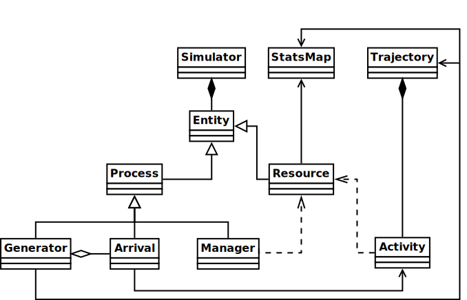
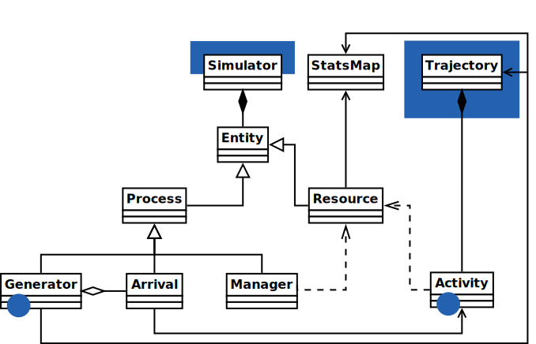

```{r setup, include=FALSE}
Sys.setlocale(locale='en_US.UTF-8')
library(knitr)
opts_chunk$set(fig.height=4, fig.width=8)
```

# Introducción

## ¿Eventos discretos?

* El sistema se puede modelar como una secuencia ordenada en el tiempo de eventos
* Cada evento produce un cambio instantáneo en el sistema
* Entre eventos, el sistema permanece invariable (eventos contables)
* La simulación puede saltar de evento en evento
* Ejemplo: sucursal bancaria

## Taxonomía de los modelos

* Determinista
* Estocástico
    * Estático $\to$ Montecarlo
    * Dinámico
        * Continuo
        * Discreto $\to$ DES

## Elementos básicos

* Input: modelo del sistema, operaciones
* Reloj
* Cola de eventos
* Bucle de eventos
* Ouput: snapshots del estado del sistema

## 

### Aplicaciones
* Diseño de procesos
* Planificación
* Optimización
* Toma de decisiones

### Áreas
* Investigación operativa
* Networking

# R y DES, el origen

## Cronología

* __enero 2015:__ _Teoría de Redes_, 2º Grado Ing. Telemática
    * Prácticas en octave (!)
        * Estadística descriptiva
        * Distribución exponencial, procesos de Poisson
        * Cadenas de Markov discretas
        * Cadenas de Markov continuas, teoría de colas
    * Encuentro simmer en GitHub
* __marzo 2015__: empiezo a colaborar
* __septiembre 2015:__ _SNTA_, MSc. Telematics
    * Construcción de un DES
    * Ejemplo en Python
* __noviembre 2015:__ simmer 3.0.0

##

```python
class Simulator(object):

  def __init__(self):
    self.now = 0
    self.queue = []
    self.processes = []
  
  def schedule(self, delay, event):
    heappush(self.queue, (self.now + delay, event))
  
  def run(self, until=1000):
    for p in self.processes:
      p.activate()
    while self.now < until:
      self.now, event = heappop(self.queue)
      event()
```

## Referencia

* R no es un lenguaje de simulación
* M/M/1, $\rho=60/66, t=10000 \to \sim 600$ k arrivals
<br><br>

| Código | Tiempo (s) |
|--------|------------|
| SimPy  | 30
| Ejemplo SNTA | 6
| Traducción a R6 | ?
| simmer 3.0.0 |      |
| simmer 3.2.1 |      |

## Referencia

* R no es un lenguaje de simulación
* M/M/1, $\rho=60/66, t=10000 \to \sim 600$ k arrivals
<br><br>

| Código | Tiempo (s) |
|--------|------------|
| SimPy  | 30
| Ejemplo SNTA | 6
| Traducción a R6 | ?
| simmer 3.0.0 | 15
| simmer 3.2.1 | 28

# Diseño

## 



## 



# Código

## API básica trayectorias

* `create_trajectory()`
    * `set_attribute()`
    * `seize()` & `release()`
    * `timeout()`
    * `branch()`
    * `rollback()`

## API básica simulador

* `simmer()`
    * `add_resource()`
    * `add_generator()`
    * `run()`
    * `get_mon_arrivals()`
    * `get_mon_resources()`
    * `get_mon_attributes()`

## Vignettes

* [Introduction to simmer](http://r-simmer.org/docs/vignettes/A-introduction.html)
* [Terminology](http://r-simmer.org/docs/vignettes/B-terminology.html)
* [Advanced Trajectory Usage](http://r-simmer.org/docs/vignettes/C-trajectories.html)
* [Queueing Systems](http://r-simmer.org/docs/vignettes/D-queueing-systems.html)
* [Continuous-Time Markov Chains](http://r-simmer.org/docs/vignettes/E-ctmc.html)

## Futuro próximo

* Actividades `batch()`/`separate()`
* Actividad `ifseize()`
* Concatenar trayectorias

##

[r-simmer.org](http://r-simmer.org)
