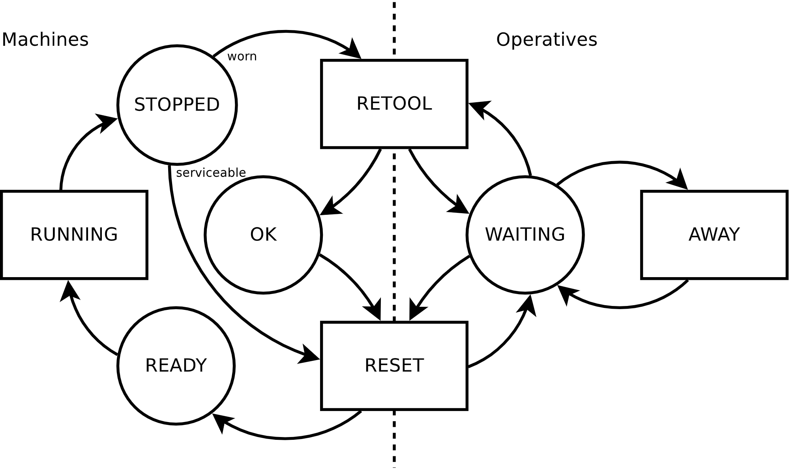
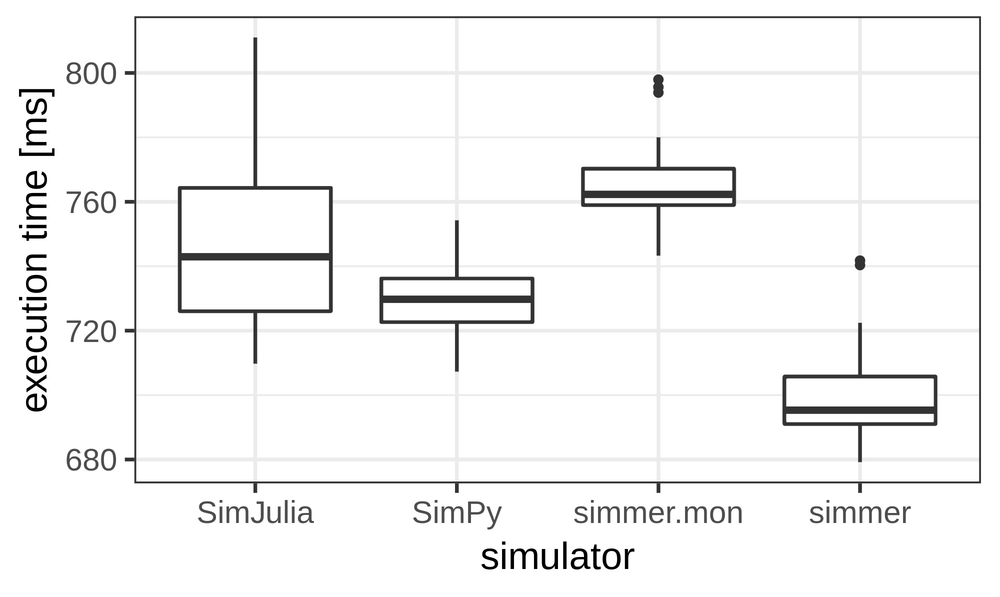

```{r setup, include=FALSE}
options(htmltools.dir.version=FALSE)
knitr::opts_chunk$set(fig.retina=3, fig.path="../images/figure-html/")
```

# Introduction

.left-column[
## Simulation
]

.right-column[
From R. Shannon (1975), simulation is

> the process of designing a **model of a real system** and conducting experiments with this model for the purpose either of **understanding the behavior of the system** or of **evaluating various strategies** [...] for the operation of the system.
]

--

.right-column[
Taxonomy, from Law and Kelton (2000):

1. deterministic vs. stochastic
2. (time component?) static vs. dynamic
3. (if dynamic) continuous vs. discrete
]

--

.right-column[
Examples:

- deterministic + dynamic + continuous = _Dynamical Systems_
- stochastic + static = _Monte Carlo Simulation_
- **stochastic + dynamic + discrete = _Discrete-Event Simulation_ (DES)**
]

---

# Introduction

.left-column[
## Simulation
## DES
]

.right-column[
What can be modelled as a Discrete-Event Simulation (DES)?

- An **event** is an instantaneous occurrence that may change the **state of the system**
- The number of events is countable
- Between events, all the state variables remain constant
- Output: snapshots of the state of the system over time
]

--

.right-column[
Common examples:

- customers arriving at a bank,
- products being manipulated in a supply chain,
- packets traversing a network,
- ...

and many more applications from manufacturing systems, construction engineering, project management, logistics, transportation systems, business processes, healthcare, telecommunications networks...
]

---

# Introduction

.left-column[
## Simulation
## DES
]

.right-column[
Programming styles (Banks 2005):

- **Activity-oriented**: fixed time increments; scan and verify conditions
- **Event-oriented**: event routines; event list ordered by time of ocurrence
- **Process-oriented**: life cycle of entities of the real system; triggered by events
]

--

.right-column[
.pull-left[
Spectrum of tools:

- High **complexity** and **specialization** generally means more accuracy

but

- More specialization requires more effort
- More complexity requires more effort
]

.pull-right[
```{r tools-spectrum, echo=FALSE, out.height='85%', out.width='85%', fig.width=3, fig.height=3}
library(ggplot2)

pal <- scales::brewer_pal("qual", palette=2)(3)

ggplot() + coord_fixed() +
  theme(axis.ticks=element_blank(), axis.title=element_blank(),
        axis.text.y=element_text(angle=90, hjust=0.5),
        panel.background=element_blank()) +
  scale_x_continuous(
    breaks=c(-1, 0, 1), limits=c(-1, 1), labels=c("low", "← complexity →", "high")) +
  scale_y_continuous(
    breaks=c(-1, 0, 1), limits=c(-1, 1), labels=c("low", "← specialization →", "high")) +
  annotate("rect", NULL, NULL, -Inf, 0, 0, Inf, alpha=.2, fill=pal[3]) +
  annotate("rect", NULL, NULL, 0, Inf, 0, Inf, alpha=.2, fill=pal[2]) +
  annotate("rect", NULL, NULL, -Inf, Inf, -Inf, 0, alpha=.2, fill=pal[1]) +
  geom_vline(xintercept=0, color="white") + geom_hline(yintercept=0, color="white") +
  annotate("text", -0.55, 0.65, label="Ad hoc") +
  annotate("text", -0.55, 0.45, label="custom tools", size=3, color="#666666") +
  annotate("text", 0.55, 0.65, label="Niche") +
  annotate("text", 0.55, 0.45, label="NS-3, OMNeT++", size=3, color="#666666") +
  annotate("text", 0, -0.45, label="General frameworks") +
  annotate("text", -0.55, -0.65, label="SimPy, simmer", size=3, color="#666666") +
  annotate("text", 0.55, -0.65, label="MATLAB SimEvents", size=3, color="#666666")
```
]
]

---

# Introduction

.left-column[
## Simulation
## DES
## `simmer`

<br><br>
]

.right-column[
Main characteristics:

- General versatile framework for fast prototyping
- Rich and user-friendly R API over a fast C++ simulation core
- Process-oriented **trajectory-based** modelling
- Automatic monitoring capabilities
- Integration with R: repeatability, analysis, visualization
]

--

.right-column[
Resources:

- Online documentation (manual + 10 vignettes): https://r-simmer.org

- **Ucar I**, Smeets B, Azcorra A (2019). “simmer: Discrete-Event Simulation for R.” _Journal of Statistical Software_, 90(2), 1-30. doi: [10.18637/jss.v090.i02](https://doi.org/10.18637/jss.v090.i02).

- **Ucar I**, Hernández JA, Serrano P, Azcorra A (2018). “Design and Analysis of 5G Scenarios with simmer: An R Package for Fast DES Prototyping.” _IEEE Communications Magazine_, 56(11), 145-151. doi: [10.1109/MCOM.2018.1700960](https://doi.org/10.1109/MCOM.2018.1700960).
]

---

# Example: Job Shop

.pull-left[
From M. Pidd (1988), Section 5.3.1:

- Jobs are allocated to the first available machine.
- Machines need to be retooled (sometimes) and reset by an operative.
- Operatives may be away attending other tasks.


]

--

.pull-right[
```{r, eval=FALSE}
job <- trajectory() %>%
  seize("machine") %>%
  timeout(RUNNING) %>%
  branch(
    CHECK_WORN, continue = TRUE,
    trajectory() %>%
      seize("operative") %>%
      timeout(RETOOL) %>%
      release("operative")
  ) %>%
  seize("operative") %>%
  timeout(RESET) %>%
  release("operative") %>%
  release("machine")
```
]

--

.pull-right[
```{r, eval=FALSE}
task <- trajectory() %>%
  seize("operative") %>%
  timeout(AWAY) %>%
  release("operative")
```
]

---

# Example: Job Shop

.pull-left[
```{r}
library(simmer); set.seed(1234)

RUNNING <- function() rexp(1, 1)
CHECK_WORN <- function() runif(1) < 0.2
RETOOL <- function() rexp(1, 2)
RESET <- function() rexp(1, 3)
AWAY <- function() rexp(1, 1)
```
<div style="height:200px"></div>
]

.pull-right[
```{r}
job <- trajectory() %>%
  seize("machine") %>%
  timeout(RUNNING) %>% #<<
  branch(
    CHECK_WORN, continue = TRUE, #<<
    trajectory() %>%
      seize("operative") %>%
      timeout(RETOOL) %>% #<<
      release("operative")
  ) %>%
  seize("operative") %>%
  timeout(RESET) %>% #<<
  release("operative") %>%
  release("machine")
```
]

.pull-right[
```{r}
task <- trajectory() %>%
  seize("operative") %>%
  timeout(AWAY) %>% #<<
  release("operative")
```
]

---

# Example: Job Shop

.pull-left[
```{r, eval=FALSE}
library(simmer); set.seed(1234)

RUNNING <- function() rexp(1, 1)
CHECK_WORN <- function() runif(1) < 0.2
RETOOL <- function() rexp(1, 2)
RESET <- function() rexp(1, 3)
AWAY <- function() rexp(1, 1)

job <- trajectory() %>%
  ...
task <- trajectory() %>%
  ...

NEW_JOB <- function() rexp(1, 5)
NEW_TASK <- function() rexp(1, 1)
```
```{r, include=FALSE}
NEW_JOB <- function() rexp(1, 5)
NEW_TASK <- function() rexp(1, 1)
```
]

--

.pull-right[
```{r}
env <- simmer("Job Shop") %>%
  add_resource("machine", 10) %>%
  add_resource("operative", 5) %>%
  add_generator("job", job, NEW_JOB) %>% #<<
  add_generator("task", task, NEW_TASK) %>% #<<
  run(until=1000)
env
```
]

--

<div style="clear:both"></div>

```{r}
aggregate(cbind(server, queue) ~ resource, get_mon_resources(env), mean)
```

---

# Simulation core design

.pull-right[
## Architecture

<br>

Overview of the C++ core (white) and R API (blue)
]

.pull-left[
## Terminology
]

--

.pull-left[
- **Resource**: server (configurable capacity) + priority queue (configurable size), supports preemption

- **Manager**: modifies resources at run time (schedule)
]

--

.pull-left[
- **Source**: creates new arrivals following some distribution of inter-arrival times

- **Arrival**: interacting processes, with attributes and prioritization values
]

--

.pull-left[
- **Trajectory**: interlinkage of activities, a common path for arrivals of the same type

- **Activity**: unit of action, main building block
]

---

# The simmer API

.left-column[
## Trajectory
]

.right-column[
Similar to `dplyr` for data manipulation. In the words of H. Wickham,

> by constraining your options, it simplifies how you can think about [something]

- Trajectories are recipes, lists of activities defining the life time of arrivals
- Activities are common functional DES blocks
]

--

.right-column[
Fixed vs. dynamic parameters:
```{r}
traj0 <- trajectory() %>%
  log_("Entering the trajectory") %>%
  timeout(10) %>%
  log_("Leaving the trajectory")
```
```{r}
traj1 <- trajectory() %>%
  log_(function() "Entering the trajectory") %>%
  timeout(function() 10) %>%
  log_(function() "Leaving the trajectory")
```
]

---

# The simmer API

.left-column[
## Trajectory
### Activities
]

.right-column[
.pull-left[
- Spend time in the system
  - `timeout`, `timeout_from_attribute`, `timeout_from_global`
- Modify arrival properties
  - `set_attribute`, `set_global`
  - `set_prioritization`
- Interaction with resources
  - `seize`, `release`
  - `set_capacity`, `set_queue_size`
  - `select`, `seize_selected`...
- Interaction with sources
  - `activate`, `deactivate`
  - `set_trajectory`, `set_source`
- Loops
  - `rollback`
]
.pull-right[
- Branching
  - `branch`
  - `clone`, `synchronize`
- Batching
  - `batch`, `separate`
- Inter-arrival communication
  - `send`, `trap`, `untrap`, `wait`
- Reneging
  - `leave`
  - `renege_in`, `renege_if`, `renege_abort`
  - `handle_unfinished`
- Debugging
  - `log_`
  - `stop_if`
]
]

--

.right-column[
(Plus many getters to retrieve parameters at run time)
]

---

# The simmer API

.left-column[
## Trajectory
### Activities
## Simulation environment
]

.right-column[
- Create a simulator and attach a monitor
  - `simmer`
  - `monitor_mem` (default), `monitor_csv`... (extensible, see `simmer.mon` on GitHub)
]

--

.right-column[
- Add sources of arrivals
  - `add_generator`: based on a distribution function
  - `add_dataframe`: based on a data frame (additional columns as attributes)
]

--

.right-column[
- Add resources
  - `add_resource`: priority resource, with capacity and queue size; optional preemption
]

--

.right-column[
- Add global variables
  - `add_global`
]

--

.right-column[
- Run the simulation
  - `run`, `stepn`
]

---

# The simmer API

.left-column[
## Trajectory
### Activities
## Simulation environment
## Monitoring
]

.right-column[
`simmer` automatically records every change in the state of the system. All these statistics can be retrieved after the simulation:

.code70[
```{r}
names( get_mon_arrivals(simmer(), per_resource=FALSE) )
names( get_mon_arrivals(simmer(), per_resource=TRUE) )
names( get_mon_attributes(simmer()) )
names( get_mon_resources(simmer()) )
```
]
]

---

# Modelling

.pull-left[
## Queueing systems

Natural way to simulate CTMC and birth-death processes:

```{r, mm1-simulation-1}
set.seed(1234)
lambda <- 2
mu <- 4
rho <- lambda/mu
```

```{r, mm1-simulation-2}
mm1.traj <- trajectory() %>%
  seize("mm1.resource", 1) %>%
  timeout(function() rexp(1, mu)) %>%
  release("mm1.resource", 1)
```

```{r, mm1-simulation-3}
mm1.env <- simmer() %>%
  add_resource("mm1.resource", 1, Inf) %>%
  add_generator("arrival", mm1.traj, 
                function() rexp(1, lambda)) %>%
  run(2000)
```
]

--

.pull-right[
```{r, mm1-plot, echo=FALSE, message=FALSE, warning=FALSE, fig.height=3.5}
library(simmer.plot)
mm1.env.res <- get_mon_resources(mm1.env)
plot(mm1.env.res, "usage", "mm1.resource", items=c("server", "queue"), steps=TRUE) +
  theme_bw() + xlim(0, 15) + ylim(0, 5) +
  theme(legend.justification=c(0, 1), legend.position=c(0.01, 0.99))
plot(mm1.env.res, "usage", "mm1.resource", items="system") +
  theme_bw() + geom_hline(yintercept=rho/(1-rho)) +
  theme(legend.justification=c(1, 0), legend.position=c(0.99, 0.01))
```
]

---

# Modelling

.pull-left[
## Replication

Easy replication with standard R functions:

```{r, eval=FALSE}
mm1.envs <- lapply(1:20, function(i) {
  simmer() %>%
    add_resource("mm1.resource", 1, Inf) %>%
    add_generator("arrival", mm1.traj, 
                  function() rexp(100, lambda)) %>%
    run(1000/lambda)
})
```
]

--

.pull-right[
## Parallelization

Even easier parallelization of replicas:

```{r}
mm1.envs <- parallel::mclapply(1:20, function(i) {
  simmer() %>%
    add_resource("mm1.resource", 1, Inf) %>%
    add_generator("arrival", mm1.traj, 
                  function() rexp(100, lambda)) %>%
    run(1000/lambda) %>%
    wrap() #<<
}, mc.cores=4)
```
]

--

<div style="clear:both"></div>

```{r}
head(get_mon_arrivals(mm1.envs), 3)
```

---

# Modelling

## Best practices

There are usually multiple valid ways of mapping the identified resources and processes into the `simmer` API

--

.pull-left[
### Design pattern 1

```{r, beep-1}
beep <- trajectory() %>%
  log_("beeeep!")
```

```{r, beep-2}
env <- simmer() %>%
  add_generator("beep", beep, function() 1) %>%
  run(2.5)
```
]

--

.pull-right[
### Design pattern 2

```{r, beep-3}
alarm <- trajectory() %>%
  timeout(1) %>%
  log_("beeeep!") %>%
  rollback(2)
```

```{r, beep-4}
env <- simmer() %>%
  add_generator("alarm", alarm, at(0)) %>%
  run(2.5)
```
]

---

# Performance

.pull-left[
Comparison with similar frameworks (out-of-date!):

- SimPy 3.0.9, Python 2.7
- SimJulia 0.3.14, Julia 0.5.1

<br>Heavy M/M/1, $\rho \approx 0.9$:

```{r, performance-mm1-simmer, eval=FALSE}
test_mm1_simmer <- function(n, m, mon=FALSE) {
  mm1 <- trajectory() %>%
    seize("server", 1) %>%
    timeout(function() rexp(1, 1.1)) %>%
    release("server", 1)
  
  env <- simmer() %>%
    add_resource("server", 1, mon=mon) %>%
    add_generator("customer", mm1,
                  function() rexp(m, 1), mon=mon) %>%
    run(until=n)
}
```
]

--

.pull-right[
.center[]
.center[]
]

---

# Performance

## The cost of calling R from C++ revisited

.pull-left[
Very simple deterministic test to study the impact:

```{r, performance-simmer}
test_simmer <- function(n, delay) {
  test <- trajectory() %>%
    timeout(delay)
  simmer() %>%
    add_generator("test", test, at(1:n)) %>%
    run() %>%
    get_mon_arrivals()
}

test_simmer(5, 1)[,1:5]
```
]

--

.pull-right[
Original benchmark in the JSS paper:

.font80[
|Expr                         |       Min|     Mean|    Median|       Max|
|:----------------------------|---------:|--------:|---------:|---------:|
|test_simmer(n, 1)            |  429.8663|  492.365|  480.5408|  599.3547|
|test_simmer(n, function() 1) | 3067.9957| 3176.963| 3165.6859| 3434.7979|
|test_R_for(n)                | 2053.0840| 2176.164| 2102.5848| 2438.6836|
]
]

--

.pull-right[
<br>Update with `-DRCPP_USE_UNWIND_PROTECT`:

.font80[
|Expr                         |       Min|     Mean|    Median|       Max|
|:----------------------------|---------:|--------:|---------:|---------:|
|test_simmer(n, 1)            |  467.8971|  481.213|  476.1667|  521.4916|
|test_simmer(n, function() 1) |  498.2631|  583.777|  561.6798|  816.1343|
|test_R_for(n)                | 1158.9348| 1201.460| 1196.7223| 1244.4041|
]
]

---

# Summary

<div style="height:1px"></div>

.font130[
- Generic yet powerful process-oriented Discrete-Event Simulation framework for R [1, 2]

- Combines a robust and **fast** C++ simulation core with a **rich and flexible** R API
]

.footnote[
[1] **Ucar I**, Smeets B, Azcorra A (2019). “simmer: Discrete-Event Simulation for R.” _Journal of Statistical Software_, 90(2), 1-30. doi: [10.18637/jss.v090.i02](https://doi.org/10.18637/jss.v090.i02).<br>
[2] **Ucar I**, Hernández JA, Serrano P, Azcorra A (2018). “Design and Analysis of 5G Scenarios with simmer: An R Package for Fast DES Prototyping.” _IEEE Communications Magazine_, 56(11), 145-151. doi: [10.1109/MCOM.2018.1700960](https://doi.org/10.1109/MCOM.2018.1700960).
]

--

.font130[
- Broad set of **activities**, the basic building block; extensible via custom routines

- Activities are chained into a **trajectory**, a common path for processes of the same type
]

--

.font130[
- **Automatic monitoring**: focus on modelling
]

--

.font130[
- **Integration**: easy replication, parallelization, analysis...
]

---
class: center, middle, inverse, mline

# Thanks, and happy  <span style="filter: invert(100%);vertical-align:-10px"></span>ing!

**https://r-simmer.org**

<br><br><br>

<div class="hexagon" style="bottom:0;left:7px"></div>
<div class="hexagon" style="bottom:0;left:143px"></div>
<div class="hexagon" style="bottom:0;left:279px"></div>
<div class="hexagon" style="bottom:0;left:415px"></div>
<div class="hexagon" style="bottom:0;left:551px"></div>

<div class="hexagon" style="bottom:118px;left:75px"></div>
<div style="position:absolute;bottom:118px;left:211px;filter:drop-shadow(2px 4px 6px black);width:129px"></div>
<div class="hexagon" style="bottom:118px;left:347px"></div>

<div class="hexagon" style="bottom:236px;left:143px"></div>
