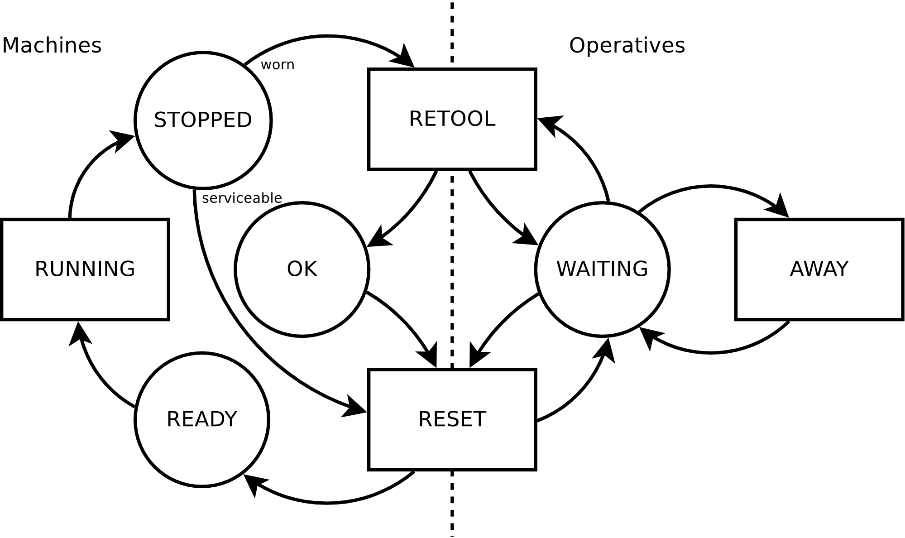
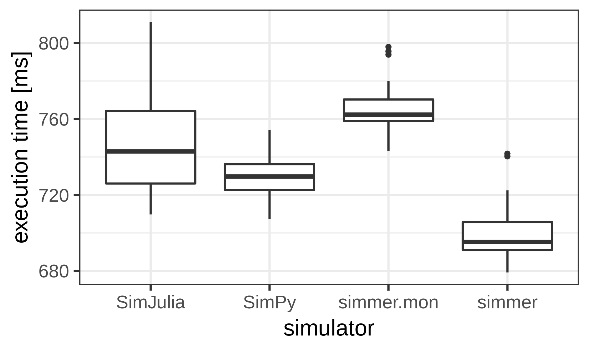
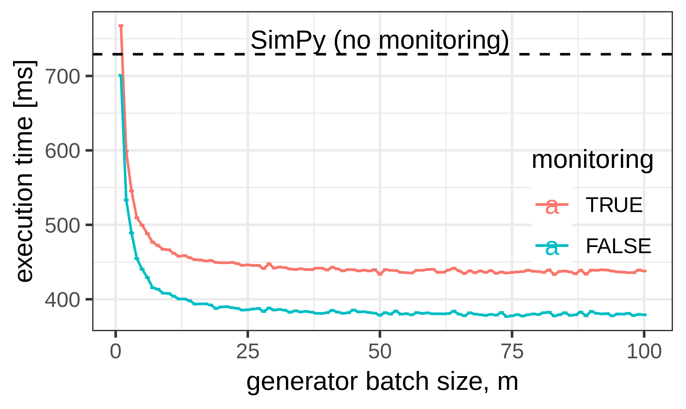

```{r setup, include=FALSE}
options(htmltools.dir.version=FALSE)
knitr::opts_chunk$set(fig.retina=3, fig.path="../images/figure-html/")
library(simmer)
```

# Introduction

.left-column[
## DES
]

.right-column[
### Examples

- customers arriving at a bank,
- products being manipulated in a supply chain,
- packets traversing a telecommunications network,
- ...
]

--

.right-column[
- **patients** traversing a **resource-constrained** healthcare system:
  - Patient view: waiting times, serving times, recovery times...
  - Resource view: allocation, scheduling, utilization...
]

--

.right-column[
### Possibilities

- **Optimization** (possibly with budget constraints)
- Compare **what-if** scenarios -> data generation
- Input of real or simulated data
]

---

# Introduction

.left-column[
## DES
## `simmer`
.sticker[]
]

.right-column[
### Characteristics

- General versatile framework for fast prototyping
- Rich and user-friendly R API over a fast C++ simulation core
- Process-oriented **trajectory-based** modelling, with rich **resource control**
- Automatic monitoring capabilities
- Integration with R: reproducibility, analysis, visualization
]

--

.right-column[
### Documentation
- Function reference: [r-simmer.org/reference](https://r-simmer.org/reference)
- Vignettes (10): [r-simmer.org/articles](https://r-simmer.org/articles)
- News: [r-simmer.org/news](https://r-simmer.org/news)
]

--

.right-column[
### Help
- Mailing list: [groups.google.com/g/simmer-devel](https://groups.google.com/g/simmer-devel)
- Discussions: [github.com/r-simmer/simmer/discussions](https://github.com/r-simmer/simmer/discussions)
- Bug reports: [github.com/r-simmer/simmer/issues](https://github.com/r-simmer/simmer/issues)
]

---

# Introduction

.left-column[
## DES
## `simmer`
.sticker[]
### Publications
]

.right-column[
#### Main reference
- **Ucar I**, Smeets B, Azcorra A (2019). “simmer: Discrete-Event Simulation for R.” _Journal of Statistical Software_, 90(2), 1-30. doi: [10.18637/jss.v090.i02](https://doi.org/10.18637/jss.v090.i02).

<br>
]

--

.right-column[
.pull-left[
#### Citing documents
- 67 citations in Google Scholar
- 19 healthcare applications
- See [zotero.org/groups/r-simmer](https://www.zotero.org/groups/r-simmer)

<br>

#### Packages
- [`babsim.hospital`](https://cran.r-project.org/package=babsim.hospital):<br>
  Hospital capacity planning
]
.pull-right[
```{r, cache=TRUE, include=FALSE}
cites <- scholar::get_article_cite_history("HLlSUg4AAAAJ", "Wp0gIr-vW9MC")
```
```{r 202211_cites, echo=FALSE, fig.asp=0.85}
library(ggplot2)

cites$healthcare <- c(NA, NA, 2, 3, 9, 5)
cites <- na.omit(cites) |>
  dplyr::mutate(other = cites - healthcare) |>
  dplyr::select(year, other, healthcare) |>
  tidyr::pivot_longer(c("other", "healthcare"), names_to="type", values_to="cites")

ggplot(cites) +
  aes(year, cites, fill=reorder(type, -cites)) +
  geom_col() + labs(fill=NULL) +
  scale_fill_discrete(type=c("#23373B", "#EB811B")) +
  theme_bw(base_size=20) +
  theme(legend.position=c(0.01, 0.99), legend.justification=c(0, 1))
```
]
]

---

# Introduction

.left-column[
## DES
## `simmer`
.sticker[]
### Publications
### Tutorials
]

.right-column[
<br>

#### About healthcare applications
- Lawton, Tom. **ICU Patient flow modelling using r-simmer**. NHS-R Conference 2019. 
  [[GitHub](https://github.com/ImprovementAcademy/ICU-Model)]

- Degeling, Koen. **Discrete Event Simulation Using `simmer` for Models Featuring Resource Constraints**.
  R for HTA Workshop 2021. [[Slides](https://r-hta.org/events/workshop/2021/degeling.pdf)]
  [[Video](https://www.youtube.com/watch?v=tAr2RpGhOTw)]

- Koffijberg, H., Van de Ven, M., Degeling, K.
  **Discrete Event Simulation in R to support healthcare decision making**,
  for the Society for Medical Decision Making.
  [[GitHub](https://github.com/koendegeling/SMDM_DESinR)]

- Koffijberg, H. and Degeling, K. **Learning and Applying Discrete Event Simulation**,
  for the Professional Society for Health Economics and Outcomes Research (ISPOR).
  [[GitHub](https://github.com/koendegeling/ISPOR_DESinR)]
]

---

# Example: Job Shop

.pull-left[
From M. Pidd (1988), Section 5.3.1:

- Jobs are allocated to the first available machine.
- Machines need to be retooled (sometimes) and reset by an operative.
- Operatives may be away attending other tasks.


]

--

.pull-right[
```{r, eval=FALSE}
job <- trajectory() %>%
  seize("machine") %>%
  timeout(RUNNING) %>%
  branch(
    CHECK_WORN, continue = TRUE,
    trajectory() %>%
      seize("operative") %>%
      timeout(RETOOL) %>%
      release("operative")
  ) %>%
  seize("operative") %>%
  timeout(RESET) %>%
  release("operative") %>%
  release("machine")
```
]

--

.pull-right[
```{r, eval=FALSE}
task <- trajectory() %>%
  seize("operative") %>%
  timeout(AWAY) %>%
  release("operative")
```
]

---

# The simmer API

.left-column[
## Trajectories
]

.right-column[
Similar to `dplyr` for data manipulation. In the words of H. Wickham,

> by constraining your options, it simplifies how you can think about [something]

- Trajectories are recipes, **lists of activities** defining the life time of arrivals
- Activities are common functional DES blocks, identified by **verbs**
]

--

.right-column[
Fixed vs. dynamic parameters:
```{r, eval=FALSE}
traj_fixed <- trajectory() %>%
  set_attribute("arrival_time", now(env)) %>%
  timeout(rexp(1, 1)) %>%
  log_("Leaving the trajectory")
```
```{r, eval=FALSE}
traj_dynamic <- trajectory() %>%
  set_attribute("arrival_time", function() now(env)) %>%
  timeout(function() rexp(1, 1)) %>%
  log_(function() paste("Leaving the trajectory at",
                        get_attribute(env, "arrival_time") - now(env)))
```
]

---

# Example: Job Shop

.pull-left[
```{r}
library(simmer); set.seed(1234)

RUNNING <- function() rexp(1, 1)
CHECK_WORN <- function() runif(1) < 0.2
RETOOL <- function() rexp(1, 2)
RESET <- function() rexp(1, 3)
AWAY <- function() rexp(1, 1)
```
<div style="height:200px"></div>
]

.pull-right[
```{r}
job <- trajectory() %>%
  seize("machine") %>%
  timeout(RUNNING) %>% #<<
  branch(
    CHECK_WORN, continue = TRUE, #<<
    trajectory() %>%
      seize("operative") %>%
      timeout(RETOOL) %>% #<<
      release("operative")
  ) %>%
  seize("operative") %>%
  timeout(RESET) %>% #<<
  release("operative") %>%
  release("machine")
```
]

.pull-right[
```{r}
task <- trajectory() %>%
  seize("operative") %>%
  timeout(AWAY) %>% #<<
  release("operative")
```
]

---

# The simmer API

.left-column[
## Trajectories
### Activities
]

.right-column[
.pull-left[
- Spend time in the system
  - `timeout`, `timeout_from_attribute`, `timeout_from_global`
- Modify arrival properties
  - `set_attribute`, `set_global`
  - `set_prioritization`
- Interaction with resources
  - `seize`, `release`
  - `set_capacity`, `set_queue_size`
  - `select`, `seize_selected`...
- Interaction with sources
  - `activate`, `deactivate`
  - `set_trajectory`, `set_source`
- Loops
  - `rollback`
]
.pull-right[
- Branching
  - `branch`
  - `clone`, `synchronize`
- Batching
  - `batch`, `separate`
- Inter-arrival communication
  - `send`, `trap`, `untrap`, `wait`
- Reneging
  - `leave`
  - `renege_in`, `renege_if`, `renege_abort`
  - `handle_unfinished`
- Debugging
  - `log_`
  - `stop_if`
]
]

--

.right-column[
(Plus many getters to retrieve parameters at run time)
]

---

# The simmer API

.left-column[
## Trajectories
### Activities
## Simulation environment
]

.right-column[
- Create a simulator and attach a monitor
  - `simmer`
  - `monitor_mem` (default), `monitor_csv`... (extensible, see `simmer.mon` on GitHub)
]

--

.right-column[
- Add sources of arrivals
  - `add_generator`: based on a distribution function
  - `add_dataframe`: based on a data frame (additional columns as attributes)
]

--

.right-column[
- Add resources
  - `add_resource`: priority resource, with capacity and queue size; optional preemption
]

--

.right-column[
- Add global variables
  - `add_global`
]

--

.right-column[
- Run the simulation
  - `run`, `stepn`
]

---

# The simmer API

.left-column[
## Trajectories
### Activities
## Simulation environment
## Monitoring
]

.right-column[
`simmer` automatically records every change in the state of the system. All these statistics can be retrieved after the simulation:

.code70[
```{r}
names( get_mon_arrivals(simmer(), per_resource=FALSE) )
names( get_mon_arrivals(simmer(), per_resource=TRUE) )
names( get_mon_attributes(simmer()) )
names( get_mon_resources(simmer()) )
```
]
]

---

# Example: Job Shop

.pull-left[
```{r, eval=FALSE}
library(simmer); set.seed(1234)

RUNNING <- function() rexp(1, 1)
CHECK_WORN <- function() runif(1) < 0.2
RETOOL <- function() rexp(1, 2)
RESET <- function() rexp(1, 3)
AWAY <- function() rexp(1, 1)

job <- trajectory() %>%
  ...
task <- trajectory() %>%
  ...

NEW_JOB <- function() rexp(1, 5) #<<
NEW_TASK <- function() rexp(1, 1) #<<
```
```{r, include=FALSE}
NEW_JOB <- function() rexp(1, 5)
NEW_TASK <- function() rexp(1, 1)
```
]

--

.pull-right[
```{r}
job.env <- simmer("Job Shop") %>%
  add_generator("job", job, NEW_JOB) %>% #<<
  add_generator("task", task, NEW_TASK) %>% #<<
  add_resource("machine", 10) %>%
  add_resource("operative", 5) %>%
  run(until=1000)
job.env
```
]

--

<div style="clear:both"></div>

```{r}
aggregate(cbind(server, queue) ~ resource, get_mon_resources(job.env), mean)
```

---

# Modelling

.pull-left[
## Replication

Easy replication with standard R functions:

```{r, eval=FALSE}
job.envs <- lapply(1:10, function(i) {
  simmer("Job Shop") %>%
    add_generator("job", job, NEW_JOB) %>%
    add_generator("task", task, NEW_TASK) %>%
    add_resource("machine", 10) %>%
    add_resource("operative", 5) %>%
    run(until=1000)
})
```
]

--

.pull-right[
## Parallelization

Even easier parallelization of replicas:

```{r}
job.envs <- parallel::mclapply(1:10, function(i) {
  simmer("Job Shop") %>%
    add_generator("job", job, NEW_JOB) %>%
    add_generator("task", task, NEW_TASK) %>%
    add_resource("machine", 10) %>%
    add_resource("operative", 5) %>%
    run(until=1000) %>%
    wrap() #<<
}, mc.cores=4)
```
]

--

<div style="clear:both"></div>

```{r}
head(subset(get_mon_arrivals(job.envs), name == "job0"), 3)
```

---

# Modelling

## Best practices

There are usually multiple valid ways of mapping the<br>
identified resources and processes into the `simmer` API

--

.pull-left[
### Design pattern 1

```{r, beep-1}
beep <- trajectory() %>%
  log_("beeeep!")
```

```{r, beep-2}
env <- simmer() %>%
  add_generator("beep", beep, function() 1) %>%
  run(2.5)
```
]

--

.pull-right[
### Design pattern 2

```{r, beep-3}
alarm <- trajectory() %>%
  timeout(1) %>%
  log_("beeeep!") %>%
  rollback(2)
```

```{r, beep-4}
env <- simmer() %>%
  add_generator("alarm", alarm, at(0)) %>%
  run(2.5)
```
]

--

<div style="clear:both;position:relative;top:-500px">
.pull-right[
### Encapsulation

```{r, encapsulation, eval=FALSE}
# global constants and functions
...

# parametrized simulation function
simulate <- function(param, t=Inf) {
  traj_1 <- trajectory() %>% ...
  ...
  
  env <- simmer() %>%
    add_generator(...) %>%
    ...
  
  run(env, until=t) %>%
    wrap()
}

# set of scenarios
cases <- expand.grid(var1=..., var2=..., ...)

# simulation
envs <- lapply(split(cases, 1:nrow(cases)), simulate)
```
]
</div>

---

# Extensions: .remark-code[simmer.plot] [](https://cran.r-project.org/package=simmer.plot)

.pull-left[
```{r, jobshop-plot, message=FALSE, warning=FALSE, fig.height=5}
library(simmer.plot)
plot(get_mon_resources(job.env)) #<<
```
```{r, jobshop-traj, eval=FALSE}
plot(job) #<<
```
]

.pull-right[
```{r, jobshop-traj, echo=FALSE}
```
]

---

# Extensions: .remark-code[simmer.bricks] [](https://cran.r-project.org/package=simmer.bricks)

.pull-left[
```{r}
library(simmer.bricks)

trajectory() %>%
  visit("res", function() rexp(1, 1), 1) #<<
trajectory() %>%
  delayed_release("res", function() rexp(1, 1), 1) #<<
```
]

.pull-right[
```{r}
env <- simmer()

trajectory() %>%
  do_parallel( #<<
    trajectory("task 1") %>%
      timeout(function() rexp(1)),
    trajectory("task 2") %>%
      timeout(function() rexp(1)),
    .env = env, wait = TRUE
  )
```
]

---

# Extensions: others

<br><br><br><br>

Package          | Description                                     | Status
---------------- | ----------------------------------------------- | ------------------
[**simmer.optim**](https://github.com/r-simmer/simmer.optim) | Parameter Optimization Functions for `simmer` | [](https://lifecycle.r-lib.org/articles/stages.html)
[**simmer.json**](https://github.com/r-simmer/simmer.json)  | Read / Load `simmer` Definitions in JSON Format | [](https://lifecycle.r-lib.org/articles/stages.html)
[**simmer.mon**](https://github.com/r-simmer/simmer.mon)  | Monitoring Backends for `simmer` | [](https://lifecycle.r-lib.org/articles/stages.html)

<!--
# Performance

.pull-left[
Comparison with similar frameworks (out-of-date!):

- SimPy 3.0.9, Python 2.7
- SimJulia 0.3.14, Julia 0.5.1

<br>Heavy M/M/1, $\rho \approx 0.9$:

```{r, performance-mm1-simmer, eval=FALSE}
test_mm1_simmer <- function(n, m, mon=FALSE) {
  mm1 <- trajectory() %>%
    seize("server", 1) %>%
    timeout(function() rexp(1, 1.1)) %>%
    release("server", 1)
  
  env <- simmer() %>%
    add_resource("server", 1, mon=mon) %>%
    add_generator("customer", mm1,
                  function() rexp(m, 1), mon=mon) %>%
    run(until=n)
}
```
]

.pull-right[
.center[]
.center[]
]-->

<!--
# Performance

## The cost of calling R from C++ revisited

.pull-left[
Very simple deterministic test to study the impact:

```{r, performance-simmer}
test_simmer <- function(n, delay) {
  test <- trajectory() %>%
    timeout(delay)
  simmer() %>%
    add_generator("test", test, at(1:n)) %>%
    run() %>%
    get_mon_arrivals()
}

test_simmer(5, 1)[,1:5]
```
]

.pull-right[
Original benchmark in the JSS paper (R 3.3.3):

.font80[
|Expr                         |       Min|     Mean|    Median|       Max|
|:----------------------------|---------:|--------:|---------:|---------:|
|test_simmer(n, 1)            |  429.8663|  492.365|  480.5408|  599.3547|
|test_simmer(n, function() 1) | 3067.9957| 3176.963| 3165.6859| 3434.7979|
|test_R_for(n)                | 2053.0840| 2176.164| 2102.5848| 2438.6836|
]
]

.pull-right[
<br>Today, R 4.1.3 + `-DRCPP_USE_UNWIND_PROTECT`:

.font80[
|Expr                         |       Min|     Mean|    Median|       Max|
|:----------------------------|---------:|--------:|---------:|---------:|
|test_simmer(n, 1)            |  398.8606|  427.928|  411.8718|  550.8392|
|test_simmer(n, function() 1) |  425.3039|  480.963|  483.6672|  620.8084|
|test_R_for(n)                |  386.3202|  453.576|  444.6313|  591.2085|
]
]-->

---

# Summary

<div style="height:1px"></div>

.font130[
- Generic yet powerful process-oriented Discrete-Event Simulation framework for R [1, 2]

- Combines a robust and **fast** C++ simulation core with a **rich and flexible** R API
]

.footnote[
[1] **Ucar I**, Smeets B, Azcorra A (2019). “simmer: Discrete-Event Simulation for R.” _Journal of Statistical Software_, 90(2), 1-30. doi: [10.18637/jss.v090.i02](https://doi.org/10.18637/jss.v090.i02).<br>
[2] **Ucar I**, Hernández JA, Serrano P, Azcorra A (2018). “Design and Analysis of 5G Scenarios with simmer: An R Package for Fast DES Prototyping.” _IEEE Communications Magazine_, 56(11), 145-151. doi: [10.1109/MCOM.2018.1700960](https://doi.org/10.1109/MCOM.2018.1700960).
]

--

.font130[
- Broad set of **activities**, the basic building block; extensible via custom routines

- Activities are chained into a **trajectory**, a common path for processes of the same type
]

--

.font130[
- **Automatic monitoring**: focus on modelling
]

--

.font130[
- **Integration**: easy replication, parallelization, analysis...
]

---
class: center, middle, inverse, mline

# Thanks, and happy  <span style="filter: invert(100%);vertical-align:-10px"></span>ing!

**https://r-simmer.org**

<br><br><br>

<div class="hexagon" style="bottom:0;left:7px"></div>
<div class="hexagon" style="bottom:0;left:143px"></div>
<div class="hexagon" style="bottom:0;left:279px"></div>
<div class="hexagon" style="bottom:0;left:415px"></div>
<div class="hexagon" style="bottom:0;left:551px"></div>

<div class="hexagon" style="bottom:118px;left:75px"></div>
<div style="position:absolute;bottom:118px;left:211px;filter:drop-shadow(2px 4px 6px black);width:129px"></div>
<div class="hexagon" style="bottom:118px;left:347px"></div>

<div class="hexagon" style="bottom:236px;left:143px"></div>
